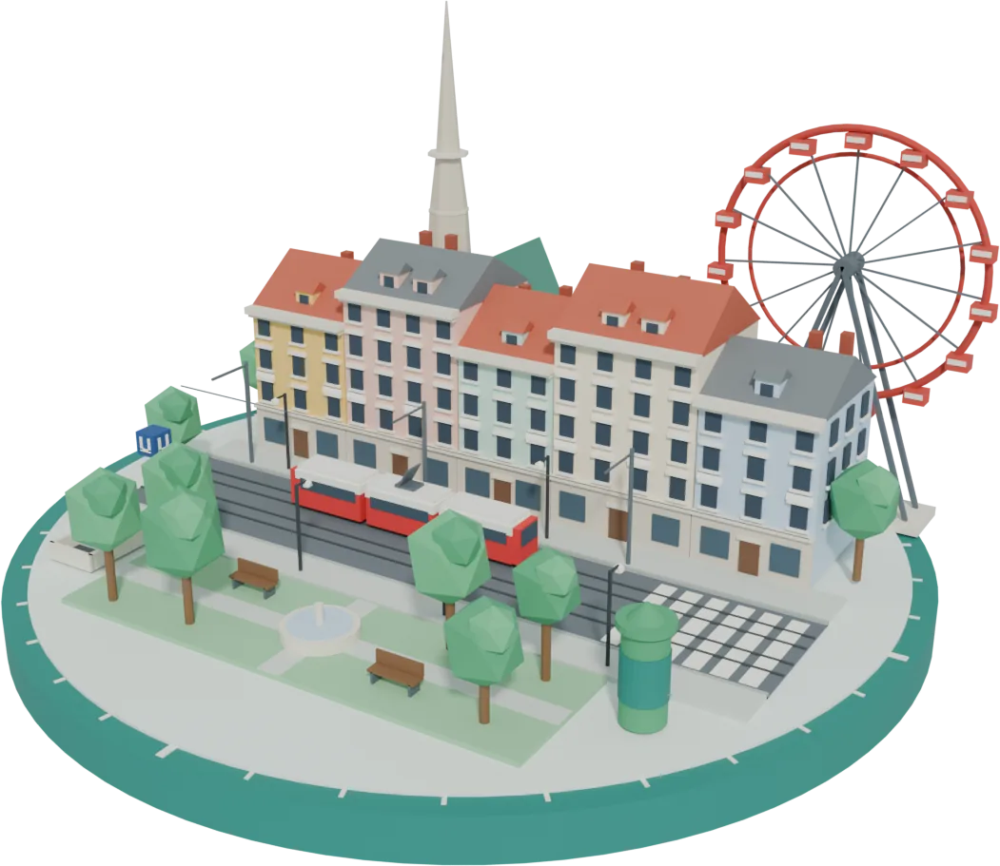
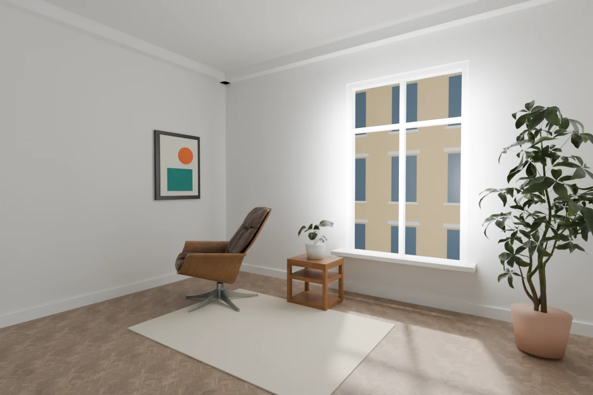
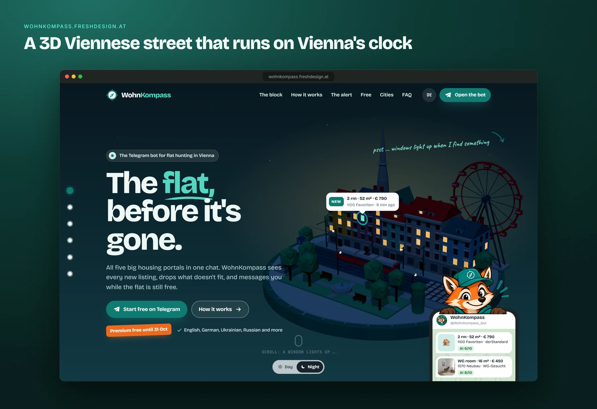
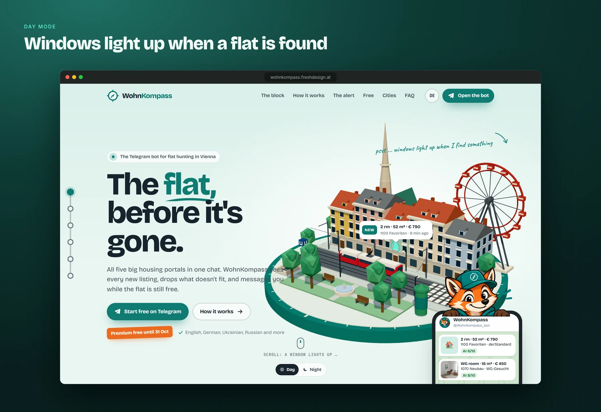
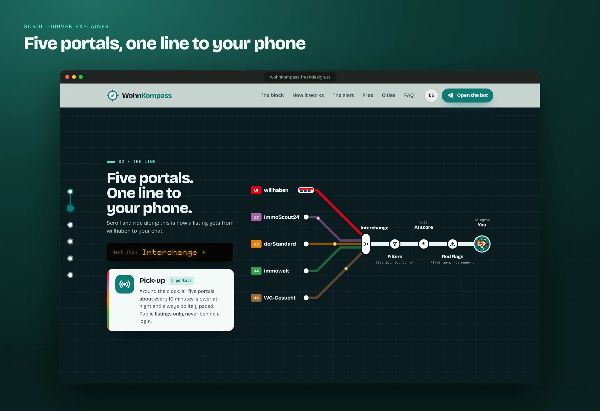
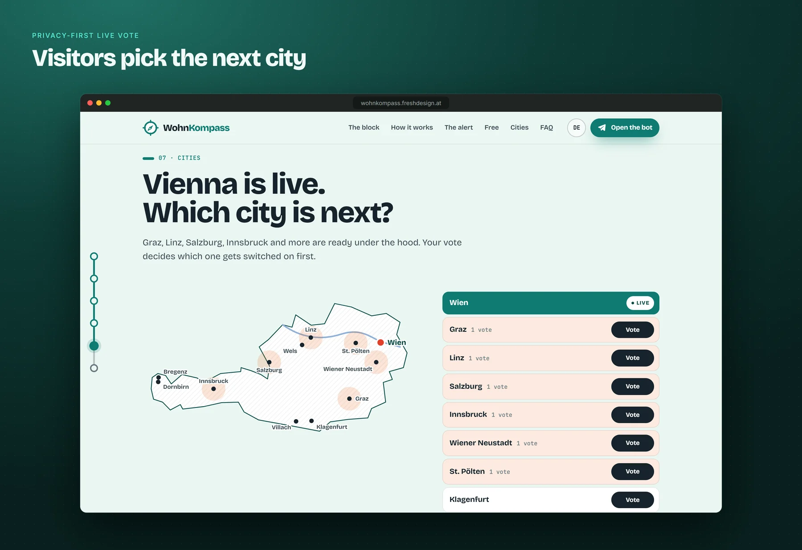
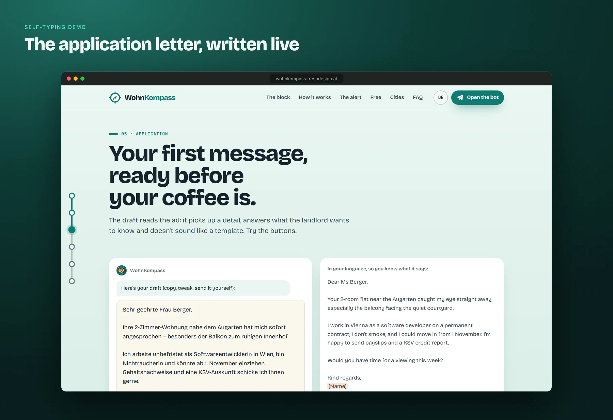
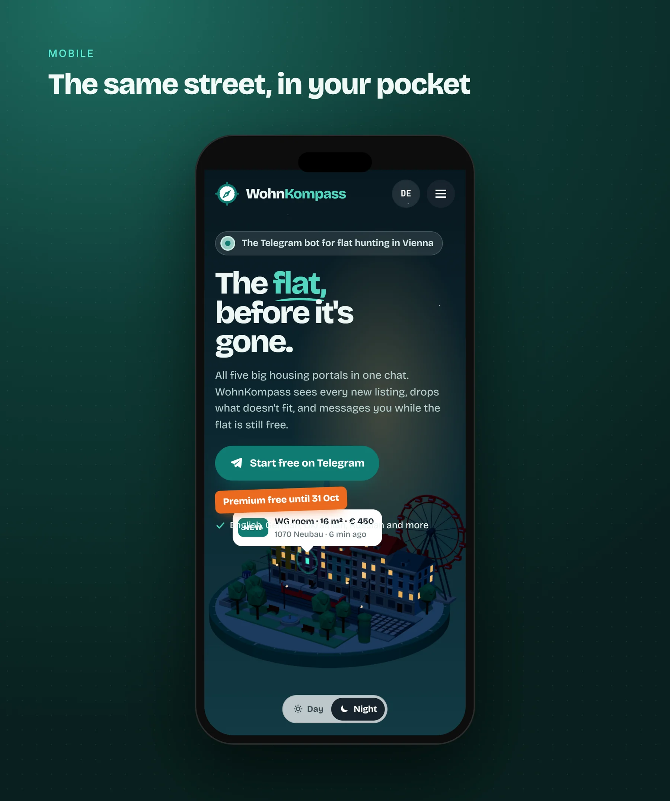

<h1 align="center">WohnKompass website</h1>

  <b>An interactive 3D Viennese street corner that explains a flat-hunting bot.</b> 
  Blender · three.js · Next.js 16 · React 19 · TypeScript · Supabase

  <a href="https://wohnkompass.freshdesign.at">Visit the live site</a> ·
  <a href="https://github.com/SwitchmanPlay/wohnkompass-showcase">The bot behind it</a>

  

> **About this repository.** The website's source code is private. This page describes what
> I built and how, so the work can be judged without the code.

---

## What a visitor sees

The landing page for my Telegram bot [WohnKompass](https://github.com/SwitchmanPlay/wohnkompass-showcase),
in German and English. Instead of a stock hero image, the page opens on a **3D "Grätzl"**
(a Viennese neighbourhood) that I modelled in Blender and that renders live in the browser.

- **A living street.** A tram drives past, the Riesenrad turns (its cabins stay upright),
  street lamps and a fountain complete the corner around Stephansdom.
- **The product, shown instead of told.** Every few seconds a window lights up with a "ping",
  a listing card follows that window on screen, and a phone mockup receives the alert.
- **Day and night follow Vienna's real clock.** At night the lamps glow and windows flicker.
  A toggle lets you switch.
- **Scroll to fly in.** The camera arcs into one lit window, and a photo-real render of the
  room behind it grows out of that window.
- **Vienna-themed explainers** further down: a Wiener Linien–style departure board, a
  scroll-driven metro ride through the bot's pipeline (portal → dedup → filter → AI rating
  → warnings → you), flipping street signs for Austrian rental vocabulary, a self-typing
  application letter, and a live map of Austria where visitors vote for the next city.

  
   The room the camera flies into, rendered in Blender Cycles (furniture: CC0 assets from Poly Haven).

## Screenshots

Captured from the live site.

<table>
  <tr><td width="50%"></td><td width="50%"></td></tr>
  <tr><td width="50%"></td><td width="50%"></td></tr>
  <tr><td width="50%"></td><td width="50%"></td></tr>
</table>

## Engineering highlights

- **Blender to browser pipeline.** The scene is exported as glTF and compressed with
  meshopt, from **632 KB to 166 KB**. Object names in Blender (`win_*`, `lamp_*`, `tram`,
  `wheel_rotor`) act as the interface between the 3D file and the code.
- **Performance.** three.js and the model load lazily, only in the browser. The render loop
  pauses when the scene is off screen or the tab is hidden, pixel ratio is capped, phones get
  smaller shadow maps, and every GPU resource is disposed on unmount.
- **Works without the fancy parts.** No WebGL or a loading error shows a static Cycles render
  instead. `prefers-reduced-motion` swaps animation for still frames, removes sticky scroll
  effects and prints the typewriter text instantly.
- **Accessibility.** Skip link, live regions, proper tab and timer roles, pressed states on
  toggles, and the decorative canvas hidden from screen readers.
- **Privacy by design.** No cookies, no trackers. The city vote runs on a Supabase Edge
  Function: voter IPs are hashed with a secret salt inside Postgres and never stored raw,
  row-level security exposes only the totals, and a scheduled job deletes the hashes after
  30 days.
- **SEO and i18n.** Separate `/de/` and `/en/` routes with hreflang, per-language Open Graph
  images generated at build time, and schema.org structured data.
- **Static export + CI/CD.** The site is exported as plain static files and deployed
  automatically by GitHub Actions on every push.
- **Small Python tool.** A script (Pillow, NumPy, SciPy) cuts the fox mascot out of flat
  artwork with flood fill and soft alpha edges.

## Tech stack

| Area | Tools |
| --- | --- |
| Framework | Next.js 16 (App Router, static export), React 19, TypeScript 5.9 |
| 3D | three.js 0.186 (GLTFLoader, meshopt, soft shadows), Blender (modelling, Cycles renders), gltf-transform |
| Styling | Hand-written CSS, no framework; Bricolage Grotesque, JetBrains Mono, Caveat, Doto |
| Backend | Supabase (Postgres, Edge Functions, row-level security, pg_cron), EU region |
| Build and deploy | GitHub Actions, static hosting |
| Tooling | Python (Pillow, NumPy, SciPy), **Claude Code** (AI-assisted development) |

## Skills this project shows

Real-time 3D for the web · 3D modelling and rendering in Blender · asset optimisation ·
Next.js / React / TypeScript · scroll-driven animation · SVG data visualisation ·
accessibility and progressive enhancement · internationalisation and SEO · serverless
Postgres security · GDPR-minded data design · CI/CD · UX copywriting in German and English

---

Built by <a href="https://github.com/SwitchmanPlay">Danylo Prokhorenko</a>, Vienna ·
<a href="https://portfolio.freshdesign.at">portfolio</a> · danyaprokhorenko@gmail.com
